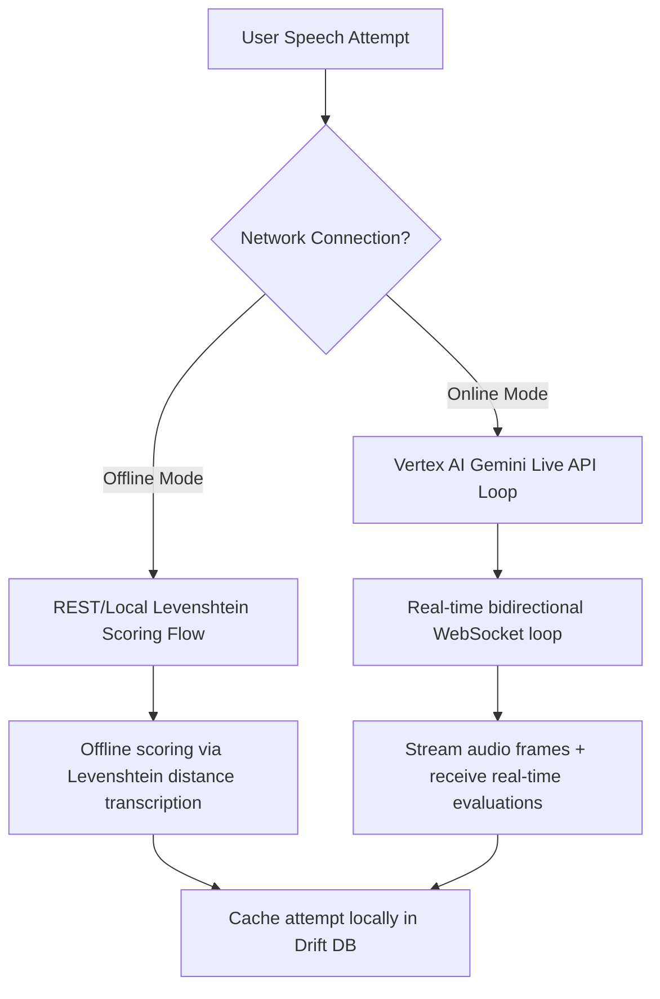

# Handa (හඬ) / AURA Speech Therapy

Handa (හඬ) / AURA is an AI-powered speech therapy companion designed specifically for Sinhala-speaking patients recovering from stroke-induced aphasia or apraxia. It integrates real-time cognitive and speech rehabilitation exercises with a biologically-mapped digital brain clone system.

---

## 🛠️ Tech Stack & Dependencies

- **Frontend Framework:** Flutter (supporting Web PWA and Native compilation)
- **State Management:** Flutter Riverpod (for structured reactive state injection)
- **Database (Local Cache):** Drift/Moor (SQLite wrapper for relational local session, category, and exercise caching)
- **Speech & Visual Analysis:** MediaPipe Face Mesh & custom WebRTC audio loop
- **Backend/AI Engine:** Google Cloud Vertex AI & Gemini Live API (via custom vendored WebSocket service `gemini_live_fork`)
- **Authentication:** OAuth2 Bearer Tokens provided via Application Default Credentials (ADC) or secure backend providers

---

## 📁 Project Organization

```
lib/
├── app/                        # Main App setup, widget wrappers, routing config
├── core/                       # App-wide shared assets, themes, constants, and utilities
│   ├── constants/              # [app_constants.dart](file:///home/jay/Workspace/Therapy/lib/core/constants/app_constants.dart) - thresholds, font sizes
│   ├── extensions/             # [theme_extensions.dart](file:///home/jay/Workspace/Therapy/lib/core/extensions/theme_extensions.dart) - haptic patterns
│   └── theme/                  # Theme styling and styling colors
├── data/                       # Data layer (APIs, repositories, database models)
│   ├── database/               # Drift DB tables, DAOs, schema generation
│   ├── datasources/            # Remote HTTP client for standard Gemini REST APIs
│   ├── repositories/           # Implementations of Domain Repositories (settings, exercises, sessions)
│   └── services/               # [live_api_service.dart](file:///home/jay/Workspace/Therapy/lib/data/services/live_api_service.dart), [thilina_prompt.dart](file:///home/jay/Workspace/Therapy/lib/data/services/thilina_prompt.dart), token managers
│       └── gemini_live_fork/   # Custom fork for Vertex AI WebSocket connections
├── domain/                     # Domain layer (business logic entities, interfaces)
│   ├── models/                 # Pure Dart models (attempts, sessions, settings)
│   ├── repositories/           # Abstract repository definitions
│   └── services/               # [scoring_engine.dart](file:///home/jay/Workspace/Therapy/lib/domain/services/scoring_engine.dart) (Levenshtein engine)
└── presentation/               # Presentation layer (Riverpod providers, screens, widgets)
    ├── providers/              # Database and UI state providers
    ├── screens/                # UI screens (dashboard, onboarding, settings, exercise session)
    └── widgets/                # Reusable UI widgets (audio player, score badges)
```

---

## 🔄 Core Architecture Flows

The application implements a dual-mode workflow to support both seamless real-time conversation and resilient offline exercises:



### 1. REST/Offline Scoring Flow
* When performing discrete picture-naming exercises without active WebSockets, the user's speech transcript is compared locally against the target vocabulary word.
* Evaluated via the Levenshtein distance string similarity algorithm inside [scoring_engine.dart](file:///home/jay/Workspace/Therapy/lib/domain/services/scoring_engine.dart).
* Results are recorded in the local Drift SQLite database as `Attempt` objects.

### 2. Vertex AI Live WebSocket Loop
* For open-ended natural conversations, the app connects to the Vertex AI Gemini Live API endpoint.
* It transmits raw 16-bit PCM audio frames over a persistent WebSocket connection, managed by [live_api_service.dart](file:///home/jay/Workspace/Therapy/lib/data/services/live_api_service.dart) and [live_service.dart](file:///home/jay/Workspace/Therapy/lib/data/services/gemini_live_fork/lib/src/live_service.dart).
* Server messages consist of metadata JSON and audio chunks streamed back to the client.

---

## 🧠 Recent Critical Resolutions

### 1. camelCase JSON Wire Format Serialization
Vertex AI's WebSocket server rejects the standard `snake_case` keys typically generated by the Gemini API models. The custom serialization has been updated to enforce `camelCase` payload keys for all outbound setup and tool messages (such as `LiveClientSetup` and `LiveClientRealtimeInput`), ensuring requests are accepted without wire-level rejection.

### 2. Binary Sniffer Router
Vertex AI sends all WebSocket responses as **binary frames** (opcode 2). To prevent decoding errors and application crashes:
* A sniffer checks the first byte of incoming binary data:
  - If the first byte is `{` (`0x7b`), the frame is treated as a JSON string and parsed into `LiveServerMessage`.
  - Otherwise, it is treated as raw binary PCM audio frames and routed directly to the playback queue.
* This separates metadata from audio packets, resolving UTF-8 decoder binder crashes.

### 3. 44-Byte WAV Header Encoder
Raw PCM audio stream outputs from Vertex AI do not have format headers. Before feeding audio into the Flutter audio playback system, a **44-byte WAV header** configured for **24kHz, 16-bit, mono PCM** is prepended:
```dart
// Prepending the header structure
final wavBytes = Uint8List(44 + pcmLength);
wavBytes.setRange(0, 44, header.buffer.asUint8List());
wavBytes.setRange(44, wavBytes.length, pcmBytes);
```
Implemented in [wav_header.dart](file:///home/jay/Workspace/Therapy/lib/data/services/gemini_live_fork/lib/src/utils/wav_header.dart) and consumed by [live_audio_player.dart](file:///home/jay/Workspace/Therapy/lib/presentation/widgets/common/live_audio_player.dart), preventing playback device failures.

### 4. 4-Tier Scoring & Mastery Thresholds
The clinical progress model implements precise, patient-encouraging thresholds configured in [app_constants.dart](file:///home/jay/Workspace/Therapy/lib/core/constants/app_constants.dart):
* **Excellent:** $\ge 90\%$ (විශිෂ්ටයි)
* **Good:** $\ge 75\%$ (හොඳයි)
* **Almost:** $\ge 60\%$ (බොහෝ දුරට හරි)
* **Try Again:** $< 60\%$ (කරදරයක් නෑ, නැවත උත්සාහ කරමු)
* **Mastery Criteria:** An exercise is flagged as mastered when a patient achieves a score of $\ge 70\%$ across 3 consecutive attempts.

### 5. Psychological Sinhala Encouragement (Thilina Persona)
Speech exercises utilize the warm, Colombo-dialect conversational Sinhala profile of **Thilina**, a virtual speech therapist. Clinical instructions inside [thilina_prompt.dart](file:///home/jay/Workspace/Therapy/lib/data/services/thilina_prompt.dart) enforce:
* Active relationship-building before task evaluations.
* Strict execution of the cueing ladder (silence $\rightarrow$ phonemic cue $\rightarrow$ semantic cue $\rightarrow$ full model).
* Patient encouragement phrases (e.g. *“හොඳයි. ඔබගේ ශරීරය විවේක වෙමින් පවතී.”* between breathing cycles).

### 6. Tactile Haptic Patterns
Haptic feedback mapping in [theme_extensions.dart](file:///home/jay/Workspace/Therapy/lib/core/extensions/theme_extensions.dart) is engineered to prevent client anxiety. It explicitly avoids using high-intensity REJECT vibrations, utilizing soft reinforcement instead:
* **Excellent:** Double heavy tap (100ms interval)
* **Good:** Single medium tap
* **Almost:** Single light tap
* **Try Again:** Gentle pulse: light tap followed by `selectionClick` after 50ms (non-punitive notification)

### 7. UI Layout Hardening
- **Settings Screen Info Row:** Wrapped settings value text in an `Expanded` widget inside [settings_screen.dart](file:///home/jay/Workspace/Therapy/lib/presentation/screens/settings/settings_screen.dart) to enforce line constraints and eliminate layout overflows.
- **Onboarding Completion:** Re-aligned navigation controls inside [onboarding_screen.dart](file:///home/jay/Workspace/Therapy/lib/presentation/screens/onboarding/onboarding_screen.dart) using a balanced `Row` with nested `Expanded` and `Align` wrappers, ensuring identical button alignment and correct visual spacing.

---

## 🚀 Getting Started

### Prerequisites
- Flutter SDK (3.22.x or higher recommended)
- Google Cloud CLI configured with default credentials (`gcloud auth application-default login`)

### Running the App
1. Get packages:
   ```bash
   flutter pub get
   ```
2. Run code generation for Drift and JSON serialization:
   ```bash
   dart run build_runner build --delete-conflicting-outputs
   ```
3. Run the application:
   ```bash
   flutter run
   ```
